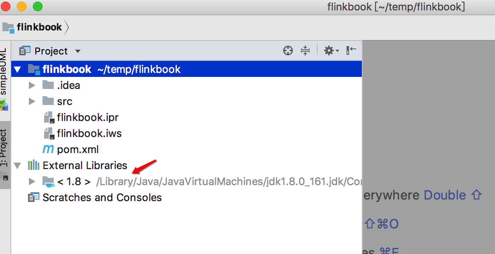
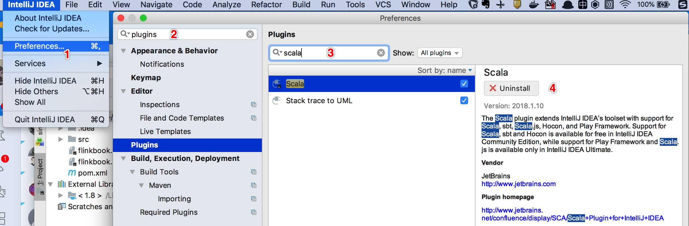
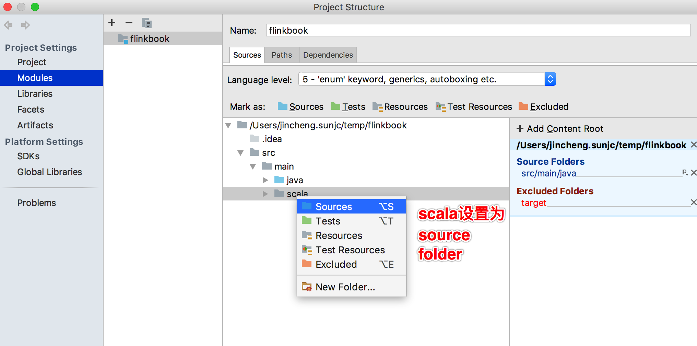
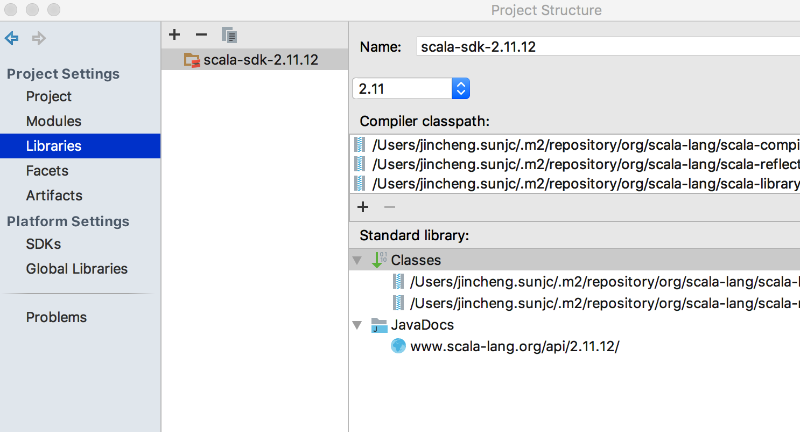
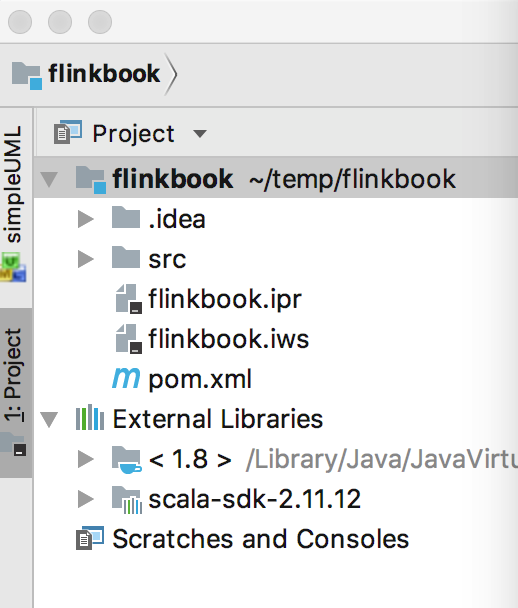
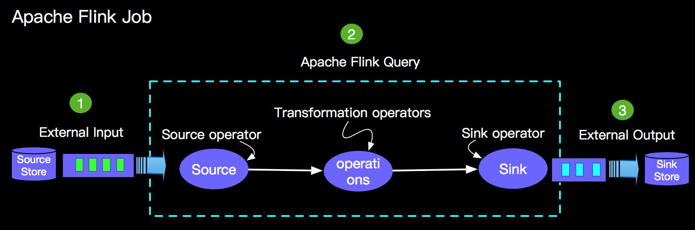

# 3.1 Apache Flink HelloWorld

# 环境准备
Apache Flink (一下简称 Flink)是跨平台的分布式计算引擎，支持在Linux，Mac OS X和Windows操作系统上运行。要运行和开发Flink程序，最基础的运行环境需要按照java 8.x, Maven和一个有助于我们开发效率的IDE。当然目前Flink也支持Scala开发，使用Scala开发还需要安装Scala 2.11.x。
下面查看一下我本机的开发环境，后续章节的代码都是在本机测试通过的，大家在运行本书各个章节代码时候尽量与如下环境一致，以避免遇上非预期的环境问题，浪费大家宝贵时间！

检查java环境，运行`java -version` 显示信息如下：

```shell
jincheng:flinkbook jincheng.sunjc$ java -version
java version "1.8.0_161"
Java(TM) SE Runtime Environment (build 1.8.0_161-b12)
Java HotSpot(TM) 64-Bit Server VM (build 25.161-b12, mixed mode)
```

检查maven环境，运行`mvn --version`显示信息如下：

```shell
jincheng:flinkbook jincheng.sunjc$ mvn --version
Apache Maven 3.3.9 (bb52d8502b132ec0a5a3f4c09453c07478323dc5; 2015-11-11T00:41:47+08:00)
Maven home: /Users/jincheng.sunjc/tool/maven
Java version: 1.8.0_161, vendor: Oracle Corporation
Java home: /Library/Java/JavaVirtualMachines/jdk1.8.0_161.jdk/Contents/Home/jre
Default locale: zh_CN, platform encoding: UTF-8
OS name: "mac os x", version: "10.13.6", arch: "x86_64", family: "mac"
```

检查scala环境，运行`scala -version`显示信息如下：

```shell
jincheng:flinkbook jincheng.sunjc$ scala -version
Scala code runner version 2.11.12 -- Copyright 2002-2017, LAMP/EPFL
```

我安装的IDE是IDEA的Ultimate Edition版本，当然Community也完全支持本书所要使用的功能。

如果您是一个新同学或者您恰巧刚刚换了一台新设备，那么上面的环境说涉及的安装包可以在如下链接下载：

* Java - https://www.oracle.com/technetwork/java/javase/downloads/jdk8-downloads-2133151.html
* Scala - https://www.scala-lang.org/download/2.11.12.html
* Maven - http://maven.apache.org/download.cgi
* IDEA - https://www.jetbrains.com/idea/download

所以总结一下我编写本书时候的开发环境信息如下：

* MacOS High Sierra 版本 10.13.6
* Java 版本 1.8.0_161
* Scala 版本 2.11.12
* Maven 版本 3.3.9
* IDEA 版本 Ultimate 2018.1

上面各个版本信息小版本号不用严格一致，但建议大版本号还是要尽量一致，先预祝大家又有个愉快的Apache Flink学习之旅！

# 创建Project

初始化Project

```shell
mvn archetype:generate \
-DgroupId=org.apache.flink.book \
-DartifactId=flinkbook \
-DarchetypeArtifactId=maven-archetype-quickstart \
-DinteractiveMode=false 
```

其中groupId，artifactId可以任意修改，archetypeArtifactId只是一个简单的模板，pom具体内容后面还会添加。interactiveMode建议大家保持用false，这样省去繁琐的交互过程。

创建完成后目录结构如下:

```shell
jincheng:temp jincheng.sunjc$ tree flinkbook/
flinkbook/
├── pom.xml
└── src
    ├── main
    │   └── java
    │       └── org
    │           └── apache
    │               └── flink
    │                   └── book
    │                       └── App.java
    └── test
        └── java
            └── org
                └── apache
                    └── flink
                        └── book
                            └── AppTest.java

13 directories, 3 files
```

pom内容如下：

```xml
jincheng:temp jincheng.sunjc$ cat flinkbook/pom.xml 
<project xmlns="http://maven.apache.org/POM/4.0.0" xmlns:xsi="http://www.w3.org/2001/XMLSchema-instance"
  xsi:schemaLocation="http://maven.apache.org/POM/4.0.0 http://maven.apache.org/maven-v4_0_0.xsd">
  <modelVersion>4.0.0</modelVersion>
  <groupId>org.apache.flink.book</groupId>
  <artifactId>flinkbook</artifactId>
  <packaging>jar</packaging>
  <version>1.0-SNAPSHOT</version>
  <name>flinkbook</name>
  <url>http://maven.apache.org</url>
  <dependencies>
    <dependency>
      <groupId>junit</groupId>
      <artifactId>junit</artifactId>
      <version>3.8.1</version>
      <scope>test</scope>
    </dependency>
  </dependencies>
</project>
```

后续我们说涉及的代码会为大家提供java和scala两种实现，我们在手工添加scala的目录结构，同时我们每个实例程序都可以独立运行，所以为了我们Project更加干净，我们可以去掉test目录和test相关的依赖。增加scala目录和清理pom依赖之后目录结构和pom内容如下:

目录结构：

```shell
jincheng:temp jincheng.sunjc$ tree flinkbook/
flinkbook/
├── pom.xml
└── src
    └── main
        ├── java
        │   └── org
        │       └── apache
        │           └── flink
        │               └── book
        └── scala
            └── org
                └── apache
                    └── flink
                        └── book

12 directories, 1 file
```

pom内容：

```xml
jincheng:temp jincheng.sunjc$ cat flinkbook/pom.xml 
<project xmlns="http://maven.apache.org/POM/4.0.0" xmlns:xsi="http://www.w3.org/2001/XMLSchema-instance"
  xsi:schemaLocation="http://maven.apache.org/POM/4.0.0 http://maven.apache.org/maven-v4_0_0.xsd">
  <modelVersion>4.0.0</modelVersion>
  <groupId>org.apache.flink.book</groupId>
  <artifactId>flinkbook</artifactId>
  <packaging>jar</packaging>
  <version>1.0-SNAPSHOT</version>
  <name>flinkbook</name>
  <url>http://maven.apache.org</url>
  <dependencies>
  </dependencies>
</project>
```

到目前为止上面的Project已经非常简洁了，我们构建IDEA项目并导入IDEA吧

```shell
jincheng:temp jincheng.sunjc$ cd flinkbook/
jincheng:flinkbook jincheng.sunjc$ mvn idea:idea
[INFO] Scanning for projects...
[INFO]                                                                         
[INFO] -------------------------------------------------------
[INFO] Building flinkbook 1.0-SNAPSHOT
[INFO] -------------------------------------------------------
[INFO] 
[INFO] >>> maven-idea-plugin:2.2.1:idea (default-cli) > generate-resources @ flinkbook >>>
[INFO] 
[INFO] <<< maven-idea-plugin:2.2.1:idea (default-cli) < generate-resources @ flinkbook <<<
[INFO] 
[INFO] --- maven-idea-plugin:2.2.1:idea (default-cli) @ flinkbook ---
[INFO] jdkName is not set, using [java version1.8.0_161] as default.
[INFO] -------------------------------------------------------
[INFO] BUILD SUCCESS
[INFO] -------------------------------------------------------
[INFO] Total time: 0.637 s
[INFO] Finished at: 2018-11-29T10:12:57+08:00
[INFO] Final Memory: 10M/245M
[INFO] -------------------------------------------------------
```

导入IDEA：

启动 IntelliJ IDEA，选择Import Project选项，并选取flinkbook目录下的 pom.xml文件，如下：


一路Next，完成导入之后我们会看到项目只是依赖的java，并没有依赖scala，如下：

所以我们要设置scala的依赖，首先添加scala插件，如下：

上图我已经安装了，如果你没有安装过，那么进行install并重启IDEA。

接下来我们配置对scala的依赖，如下：

右键flinkbook项目，选择Open-Module-Settings之后，设置如下：

设置source folder


添加scala依赖


选择依赖版本，我选择了2.11.12




点击Apply之后完成设置，这时候Project已经有scala的依赖了，如下：



检验java环境：

验证scala环境:

到这里我们环境准备工作已经完成，接下来开始Apache Flink学习之旅！

#  HelloWorld

Apache Flink 为用户提供了SQL/TableAPI，DataSetAPI和DataStreamAPI，为了让大家先睹为快，我们分别用SQL，TableAPI，DataSetAPI和DataStreamAPI为大家实现一个大数据计算领域的经典功能 - WordCount。

首先我们要为项目添加Apache Flink相关的依赖，pom依赖如下： 

```xml
<project xmlns="http://maven.apache.org/POM/4.0.0" xmlns:xsi="http://www.w3.org/2001/XMLSchema-instance"
  xsi:schemaLocation="http://maven.apache.org/POM/4.0.0 http://maven.apache.org/maven-v4_0_0.xsd">
  <modelVersion>4.0.0</modelVersion>
  <groupId>org.apache.flink.book</groupId>
  <artifactId>flinkbook</artifactId>
  <packaging>jar</packaging>
  <version>1.0-SNAPSHOT</version>
  <name>flinkbook</name>
  <url>http://maven.apache.org</url>
  <properties>
    <table.version>1.6-SNAPSHOT</table.version>
  </properties>

  <dependencies>
    <dependency>
      <groupId>org.apache.flink</groupId>
      <artifactId>flink-table_2.11</artifactId>
      <version>${table.version}</version>
    </dependency>

    <dependency>
      <groupId>org.apache.flink</groupId>
      <artifactId>flink-scala_2.11</artifactId>
      <version>${table.version}</version>
    </dependency>

    <dependency>
      <groupId>org.apache.flink</groupId>
      <artifactId>flink-streaming-scala_2.11</artifactId>
      <version>${table.version}</version>
    </dependency>

    <dependency>
      <groupId>org.apache.flink</groupId>
      <artifactId>flink-streaming-java_2.11</artifactId>
      <version>${table.version}</version>
    </dependency>
  </dependencies>
</project>
```

在编写第一Flink job之前我们先简单了解一下Flink job的结构，如下图所示：

1. 外部数据源，比如Kafka, Rabbitmq, ,CSV 等等

2. 查询计算逻辑，比如最简单的数据导入select，双流Join，Window计算等

3. 外部结果存储，比如Kafka，Cassandra，CSV等等


说明：1和3 在Apache Flink中统称为Connector。

## ## WordCount with SQL

根据上面Flink job基本结构介绍，要SQL完成WordCount的计算需求，我们需要完成三部分代码：

* TableSoruce Code - 用于创建数据源的代码
* SQL Query Code - 用于进行word count统计的sql逻辑
* TableSink Code - 用于保存word count计算结果的结果表代码

### TableSource code

Flink SQL job的Source operator需要实现TableSource，为了不依赖与外部存储，我们选择用Flink 内置的CsvTableSource作为WordCount的数据源。我们编写生成CsvTableSource的代码如下：

```scala
def genWordCountSource: CsvTableSource = {
    // 测试数据
    val csvRecords = Seq(
      "words",
      "Hello Flink",
      "Hi, Apache Flink",
      "Apache FlinkBook"
    )
    // 测试数据写入临时文件
    val tempFilePath =
      FileUtils.writeToTempFile(csvRecords.mkString("$"), "csv_source_", "tmp")

    // 创建Source connector
    new CsvTableSource(
      tempFilePath,
      Array("words"),// Soruce 表的字段
      Array(
        Types.STRING // words 的数据类型
      ),
      fieldDelim = "#",
      rowDelim = "$",
      ignoreFirstLine = true,
      ignoreComments = "%"
    )
  }
```

### SQL Query Code

Word count的查询统计，首先需要对原始数据进行分词，所以首先要开发一个User-Defined table function，用于对原始数据进行分词，比如：input是"Hello Flink",将会被分为 “Hello”和“Flink”两个单词，具体代码如下：

```scala
class TokenizerUDTF extends TableFunction[String] {
    def eval(input: String) {
      val stringTokenizer = new StringTokenizer(input, ",!' .;", false)
      while(stringTokenizer.hasMoreElements()) {
        val word = stringTokenizer.nextToken.trim.toLowerCase
        collect(word)
      }
    }
  }
```

Word count的查询统计，需要根据word进行分组，让后分别对word进行计数统计，所以完成的查询SQL如下：

```sql
SELECT
  word, COUNT(word) cnt -- 统计word以及对应的count
FROM (
    -- 内层查询对输入数据进行分词
    SELECT 
      word 
    FROM csvSource, 
      LATERAL TABLE(tokenizer(words)) AS T(word)
  )
GROUP BY word -- 按word进行分组
```

### SinkTable Code

Word count的查询统计的计算结果应该包含word和word对应的count，两个字段。Flink中有三种类型的Sink，分别如下：

* AppendSink - 比如log等只支持Insert的结果表
* UpsertSink - 比如HBase,RMDB等支持Insert和update的结果表
* RetractSink - 只支持Insert和Delete两种操作的结果表

在Word count示例中我们需要根据word不断的更新变化，所以我们需要UpsertSink或者RetractSink，我们选取RetractSink类型，自定义一个RetractSinkTable。代码如下：

```scala
class MemoryRetractSink extends RetractStreamTableSink[Row] {

  var fNames: Array[String] = _
  var fTypes: Array[TypeInformation[_]] = _

  override def getRecordType: TypeInformation[Row] = new RowTypeInfo(fTypes, fNames)

  override def emitDataStream(s: DataStream[JTuple2[JBool, Row]]): Unit = {
    s.addSink(new RichSinkFunction[JTuple2[JBool, Row]] {
      private var resultSet: mutable.Set[Row] = _

      override def open(parameters: Configuration): Unit = {
        resultSet = new mutable.HashSet[Row]
      }

      override def invoke(v: JTuple2[JBool, Row], context: SinkFunction.Context[_]): Unit =
        RowCollector.addValue(v)

      override def close(): Unit = {
        val results = RowCollector.retractResults()
        results.foreach(println)
        val path = FileUtils.writeToTempFile(
          results.mkString(System.getProperty("line.separator")),
          "csv_sink_", "tmp")
        println("---------------------------------")
        println("You can run [ cat " + path + " ]")
      }
    })
  }

  override def getFieldNames: Array[String] = fNames

  override def getFieldTypes: Array[TypeInformation[_]] = fTypes

  override def configure(
    fieldNames: Array[String],
    fieldTypes: Array[TypeInformation[_]]): TableSink[JTuple2[JBool, Row]] = {
    val copy = new MemoryRetractSink
    copy.fNames = fieldNames
    copy.fTypes = fieldTypes
    copy
  }
}

object RowCollector {
  private val sink: mutable.ArrayBuffer[JTuple2[JBool, Row]] =
    new mutable.ArrayBuffer[JTuple2[JBool, Row]]()

  def addValue(value: JTuple2[JBool, Row]): Unit = {
    // make a copy
    val copy = new JTuple2[JBool, Row](value.f0, Row.copy(value.f1))
    sink.synchronized {
      sink += copy
    }
  }

  /** Converts a list of retraction messages into a list of final results. */
  def retractResults(): List[String] = {
    val results = sink.toList
    sink.clear()
    val retracted =
      results
      .foldLeft(Map[String, Int]()) { (m: Map[String, Int], v: JTuple2[JBool, Row]) =>
        val cnt = m.getOrElse(v.f1.toString, 0)
        if (v.f0) {
          m + (v.f1.toString -> (cnt + 1))
        } else {
          m + (v.f1.toString -> (cnt - 1))
        }
      }.filter { case (_, c: Int) => c != 0 }

    retracted.flatMap { case (r: String, c: Int) => (0 until c).map(_ => r) }.toList
  }
}
```

### 完整的主程序

```scala
def main(args: Array[String]): Unit = {
    // Streaming 环境
    val env = StreamExecutionEnvironment.getExecutionEnvironment
    val tEnv = TableEnvironment.getTableEnvironment(env)
    //方便我们查出输出数据
    env.setParallelism(1)

    val sourceTableName = "csvSource"
    // 创建CSV source数据结构
    val tableSource = CsvTableSourceUtils.genWordCountSource
    // 注册source
    tEnv.registerTableSource(sourceTableName, tableSource)

    // 注册udtf
    val tokenizer = new TokenizerUDTF
    tEnv.registerFunction("tokenizer", tokenizer)

    // 注册retract sink
    val sinkTableName = "retractSink"
    val fieldNames = Array("word", "count")
    val fieldTypes: Array[TypeInformation[_]] = Array(Types.STRING, Types.LONG)

    tEnv.registerTableSink(
      sinkTableName,
      fieldNames,
      fieldTypes,
      new MemoryRetractSink)

    val sql =
      """
        |SELECT
        |   word, COUNT(word) cnt
        | FROM (
        |   SELECT word FROM csvSource, LATERAL TABLE(tokenizer(words)) AS T(word)
        | )
        |GROUP BY word
      """.stripMargin

    // 执行查询
    val result = tEnv.sqlQuery(sql)
    // 将结果插入sink
    result.insertInto(sinkTableName)
    //执行job
    env.execute()
  }
```

### 在IDE中运行结果如下：

